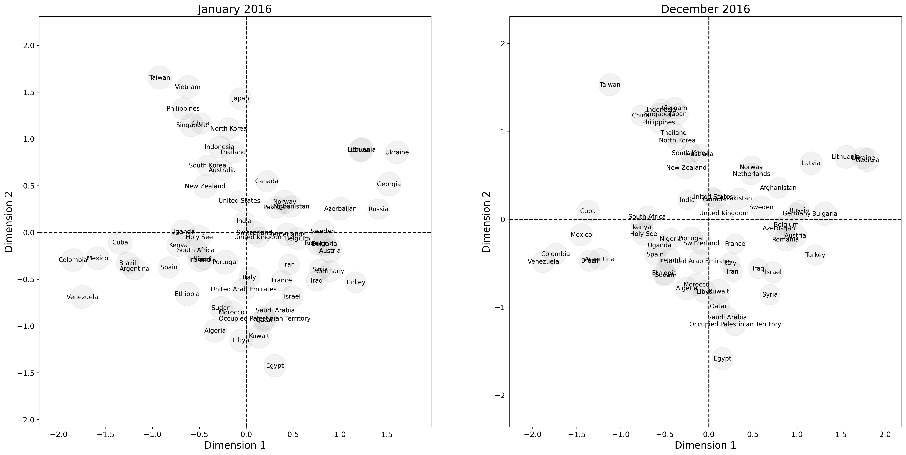

[](https://github.com/joshloyal/multidynet/blob/master/LICENSE)

# An Eigenmodel for Dynamic Multilayer Networks

*Author: [Joshua D. Loyal](https://joshloyal.github.io/)*

This package provides an interface for the model described in
"An Eigenmodel for Dynamic Multilayer Networks". Inference is performed using
coordinante ascent variational inference. For more details, see [Loyal and Chen (2021)](https://arxiv.org/abs/2103.12831).


Dependencies
------------
``multidynet`` requires:

- Python (>= 3.10)

and the requirements highlighted in [requirements.txt](requirements.txt). To install the requirements, run

```python
pip install -r requirements.txt
```

Installation
------------
You need a working installation of numpy, scipy, and Cython to install ``multidynet``. Install the required these dependencies before proceeding.  Use the following commands to get the copy from GitHub and install all the dependencies:

```
git clone https://github.com/joshloyal/multidynet.git
cd multidynet
pip install -r requirements.txt
python setup.py install
```

Example
-------

```python
import matplotlib.pyplot as plt

from multidynet import DynamicMultilayerNetworkLSM
from multidynet.datasets import load_icews
from multidynet.plots import plot_latent_space


# load ICEWS data set (4 layers, 12 months and 65 countries)
Y, countries, layer_labels, time_labels = load_icews(dataset='small')
Y.shape
# >>> (4, 12, 65, 65)

# fit the model
model = DynamicMultilayerNetworkLSM(max_iter=500, n_features=2, init_type='svt')
model.fit(Y)

# extract the homophily coefficients (all positive)
print(model.lambda_)
# [[1.         1.        ]
#  [0.93377735 0.82923015]
#  [1.20083304 1.40344605]
#  [1.06239543 1.30391721]]

# plot the shared latent space
fig, ax = plt.subplots(figsize=(20, 6), ncols=2)

# January 2016
k = 0
t = 0
plot_latent_space(Y[k, t], model.Z_[t], X_sigma=model.Z_sigma_[t],
                   with_labels=True, font_size=10,
                   contour_alpha=0.1,
                   size=0, edge_width=0,
                   node_labels=countries,
                   ax=ax[0])
ax[0].axhline(0, linestyle='--', c='k')
ax[0].axvline(0, linestyle='--', c='k')
ax[0].set_xlabel('Dimension 1')
ax[0].set_ylabel('Dimension 2')
ax[0].set_title(time_labels[t])

# December 2016
k = 0
t = 11
plot_latent_space(Y[k, t], model.Z_[t], X_sigma=model.Z_sigma_[t],
                   with_labels=True, font_size=10,
                   contour_alpha=0.1,
                   size=0, edge_width=0,
                   node_labels=countries,
                   ax=ax[1])
ax[1].axhline(0, linestyle='--', c='k')
ax[1].axvline(0, linestyle='--', c='k')
ax[1].set_xlabel('Dimension 1')
ax[1].set_ylabel('Dimension 2')
ax[1].set_title(time_labels[t])

plt.show()
```



Simulation Studies and Real-Data Applications
---------------------------------------------

The [scripts](scripts) directory includes the simulation studies and real-data applications found in the main article.
